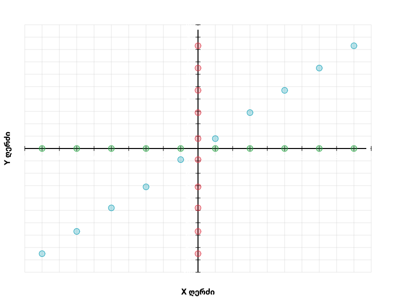

# შუალედური გამოცდის ანგარიში

## ამოცანა 1: კორელაციის მოძებნა

სურათზე ვხედავთ მონაცემებს რომლებიც აღებულია მოცემული ლინკიდან:




ამოცანა გვთხოვს პირსონის კორელაციის დათვლას ამ მონაცემებისთვის.
ამისთვის ჩვენ:
1. გადავიტანეთ მონაცემები პითონის კოდში
```python
x = np.array([-9, -7, -5, -3, -1, 1, 3, 5, 7, 9])
y = np.array([-8.5, -6.7, -4.8, -3.1, -0.9, 0.8, 2.9, 4.7, 6.5, 8.3])
```
2. დავწერეთ პირსონის კოეფიციენტის გამოთვლის ფორმულა numpy-ს დახმარებით
```python
# calculate intermediate vectors
x_sub_mean = x - x.mean()
y_sub_mean = y - y.mean()

# calculate covariance
cov_x_y = (x_sub_mean * y_sub_mean).sum()
# calculate std dev of x and y
dx = np.sqrt((x_sub_mean**2).sum())
dy = np.sqrt((y_sub_mean**2).sum())

# calculate pearson coefficient
pearson_r = cov_x_y / (dx * dy)
```
3. შევადარეთ ჩვენი დათვლილი პირსონის კოეფიციენტი scipy-ს მიერ დათვლილს რათა დავრწმუნდეთ რომ პასუხი სწორია
```python
scipy_r = stats.pearsonr(x, y)
assert pearson_r == scipy_r.statistic
```
4. კოდის გაშვების შემთხვევაში მივიღებთ პასუხს `pearson coefficient = 0.9998310928281889`

მოცემული ნაბიჯების კოდის ნახვა შესაძლებელია  ფაილში.

## ამოცანა 2: სპამ ელფოსტის გამოვლენა

ამოცანის სრუყოფილი კოდი არის ფაილ  ფაილში.

ამოცანის საკითხები:
1. რეპოზიტორიაში ატვირთული მონაცემები: 

2.1. წავიკითხოთ და დავყოთ მონაცემები სასწავლ და სატესტო სეტებად:
```python
df = pd.read_csv("./aleksandre_khokhiashvili_2_86214954.csv")

X = df[["words", "links", "capital_words", "spam_word_count"]]
y = df["is_spam"]
# split data into 70% train and 30% test
X_train, X_test, y_train, y_test = train_test_split(
    X, y, test_size=0.30, random_state=0x1337
)
```
2.2. გავწრთვნად მოდელი:
```python
# Train the logistic regression model
model = LogisticRegression()
model.fit(X_train, y_train)

print(f'Resulting model coefficients: {model.coef_}')
```
2.3. მიღებული კოეფიციენტები:
```
Resulting model coefficients: [[0.00723578 0.78929072 0.3869671  0.72727154]]
```
3.1. მოცემული კოდით ჩვენ ვამოწმებთ მოდელის შედეგებს სატესტო 30% მონაცემებზე:
```python
# Evaluate the model
y_pred = model.predict(X_test)
accuracy = accuracy_score(y_test, y_pred)
conf_matrix = confusion_matrix(y_test, y_pred)

print(f'Accuracy: {accuracy:.2f}')
print('Confusion Matrix:')
print(conf_matrix)
```
3.2. მივიღეთ მოცემული accuracy და confusion matrix:
```
Accuracy: 0.97
Confusion Matrix:
[[356  12]
 [ 14 368]]
```
3.3. 97% accuracy ცუდი არ არის, და ვხედავთ რომ false positive-ები და false negative-ები არც თუ ისე ბევრია.

4.1. ტექსტის სპამზე შემოწმებისთვის ჯერ დაგვჭირდება ფუნქცია რომელიც დაგვეხმარება ტექსის მოდელის მონაცემებში გადაყვანაში `["words", "links", "capital_words", "spam_word_count"]`
```python
spam_words = open('./spam-words-EN.txt').read().splitlines()
# make all spam words lowercase
spam_words = [word.lower() for word in spam_words]

# "words", "links", "capital_words", "spam_word_count"
def data_from_email(email_text: str):
    url_extract_pattern = "https?:\\/\\/(?:www\\.)?[-a-zA-Z0-9@:%._\\+~#=]{1,256}\\.[a-zA-Z0-9()]{1,6}\\b(?:[-a-zA-Z0-9()@:%_\\+.~#?&\\/=]*)"
    words = len(email_text.split())
    links = len(re.findall(url_extract_pattern, email_text))
    capital_words = 0
    spam_word_count = 0
    for spam_word in spam_words:
        if spam_word in email_text.lower():
            spam_word_count += 1
    for word in email_text.split():
        # check first letter of the word
        if word[0] in string.ascii_uppercase:
            capital_words += 1
    return np.array([words, links, capital_words, spam_word_count])
```
4.2. და ფუქნცია რომელიც იმეილის ტექსტს ჩასვამს ჩვენს მოდელში:
```python
def check_is_spam(email: str):
    X = data_from_email(email)
    return model.predict(np.array([X]))[0]
```
5. კარგი მეილის მაგალითი დამატებულია  ფაილში. გადავცეთ ეს ტექსტი ჩვენს ფუნქციას:
```python
good_email = open('email_good.txt').read()
print('good email is_spam = ', check_is_spam(good_email))
```
მივიღეთ პასუხი:
```
good email is_spam =  0
```
6. ანალოგიურად ცუდი მეილის მაგალითი დამატებულია  ფაილში. ანალოგიურად გავუშვათ ისიც და მივიღეთ პასუხი:
```
bad email is_spam =  1
```
7. TODO
